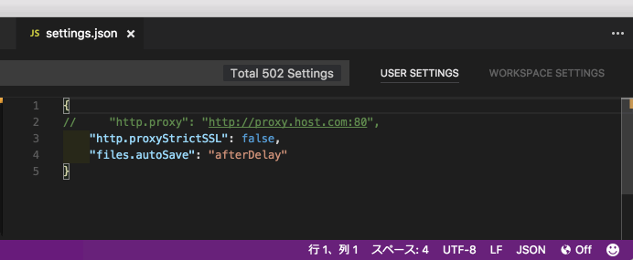
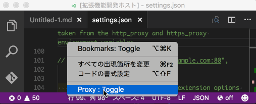

# vscode-toggleproxy

## Functions provided

This extension toggles `enable` or `disable` the `http_proxy` item in `settings.json`.

* The setting status of `http_proxy` is displayed in the status bar.



## Installation

* Press F1 in VSCode, type `ext install` and then look for `proxy`.

## Usage

* Click the  (globe) icon on the status bar. To toggle the setting.
* Available commands: `Proxy : Toggle`
* Or context menu: `Proxy : Toggle`
* Or Automatically switch (when Enabled)

## Automatically switch

Added a monitor to the proxy server (set to `http.proxy`) by ping (Every 15 seconds) and automatically switch `http.proxy`.

Enable automatic switching (default: false) in `settings.json`:

`"toggleproxy.autochange": true`

The setting will take effect after restarting vscode.

## `http_proxy` Toggle Notification

Add http_proxy toggle notification.

`toggleproxy.notifier": true`

If you want to disable it, set to `false`. (default: `true`)


## tips

vscode-toggleproxy has effect only on VS Code. There is no effect on git/npmn/typings etc...
When executing with terminal, set the `http_proxy` and `https_proxy` environment variable and execute the command.

<!--.bash_profile example: 

```bash
if `ping -c 2 -W 500 proxy.server.com > /dev/null` ; then
  echo 'proxy is alive.'
  export http_proxy="http://proxy.server.com:80"
  export https_proxy="http://proxy.server.com:80"
else
  echo 'proxy is dead.'
  unset http_proxy
  unset https_proxy
fi
```-->

## Notes

Please make a backup of settings.json.

* **Windows**: `%APPDATA%\Code\User\settings.json` or `%APPDATA%\Roaming\Code - Insiders\User\settings.json`
* **Mac**: `$HOME/Library/Application Support/Code/User/settings.json` or `$HOME/Library/Application Support/Code - Insiders/User/settings.json`
* **Linux**: `$HOME/.config/Code/User/settings.json` or `$HOME/.config/Code - Insiders/User/settings.json`

> Just in case, Make a copy of settings.json in `extensionPath`.
>
> ExtensionPath is an example: `$HOME/.vscode/extensions/satokaz.vscode-toggleproxy-$VERSION/`

# Changelog

* 0.4.3 - 2017/1/30
  * Add http_proxy toggle notification. 
  * Make a copy of settings.json in `extensionPath`. (ExtensionPath is an example: `$HOME/.vscode/extensions/satokaz.vscode-toggleproxy-$VERSION/`)

  
* 0.4.2 - 2016/12/26
  * Change file reading to synchronous read/write
  * Change ping to 10 to 15 second interval

* 0.4.1 - 2016/12/17
  * Suppress debug output

* 0.4.0 - 2016/11/18
  * Added automatic switching by ping

* 0.3.0 - 2016/10/30 (PR #1 - Thanks to @rlasjunies)
  * Fix tooltips text 

* 0.2.0 - 2016/07/26 
  * Wrong environment variables in Windows platform

* 0.1.0 - 2016/07/22 
  * Add Context Menu

    


## License

This extension is licensed under the MIT License.

<!--### For more information-->

**Enjoy!**

